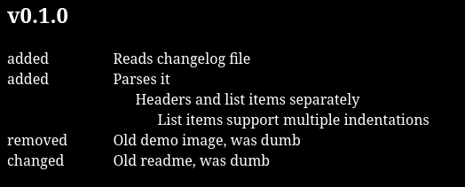

[](https://github.com/razvanbackpack/clgview/blob/main/LICENSE)
[](https://github.com/razvanbackpack/clgview/tags)

A simple php script that parses and displays changelog files.


Example:
``` 
# v0.1.0 

## added
- Reads changelog file
- Parses it
  - Headers and list items separately
    - List items support multiple indentations

## removed
- Old demo image, was dumb

## changed
- Old readme, was dumb


changelog.md
```

```
require __DIR__ . '/../vendor/autoload.php';
use ClgView\ClgView;

$options = [
    'tab' => '&nbsp;&nbsp;&nbsp;',
    'subtitles_as_labels' => true,
    'item_ids' => [
        'title' => 'title_id',
        'subtitle' => 'subtitle_id',
        'marker' => 'marker_id',
        'list_container' => 'container_id',
        'list_item' => 'item_id',
    ],
    'item_classes' => [
        'title' => 'title_class',
        'subtitle' => 'subtitle_class',
        'marker' => 'marker_class',
        'list_container' => 'container_class',
        'list_item' => 'item_class',
    ],
];

$ClgView = new ClgView('CHANGELOG.md', $options);
$ClgView->parse();
```

